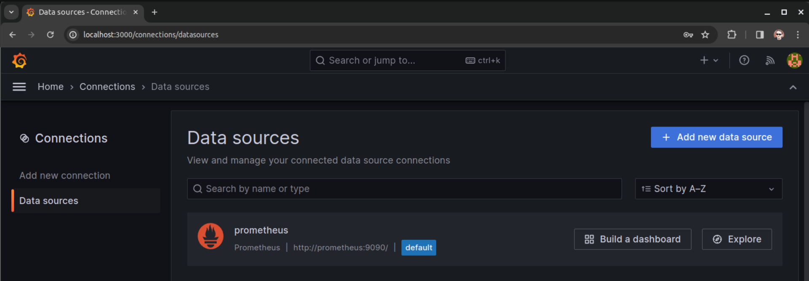

### Задание повышенной сложности.  
Для развертывания prometheus, node-exporter и Grafana написаны [docker-compose.yml](docker-compose.yml) и [конфиг prometheus](prometheus.yml).  

### Задание 1. Подключение Datasource и пруфы.  
Вошел в веб-интерфейс развернутой Grafana, сменил дефолтный пароль, подключил соседний prometheus.  

### Задание 2. Создание дашбордов с панелями.  

