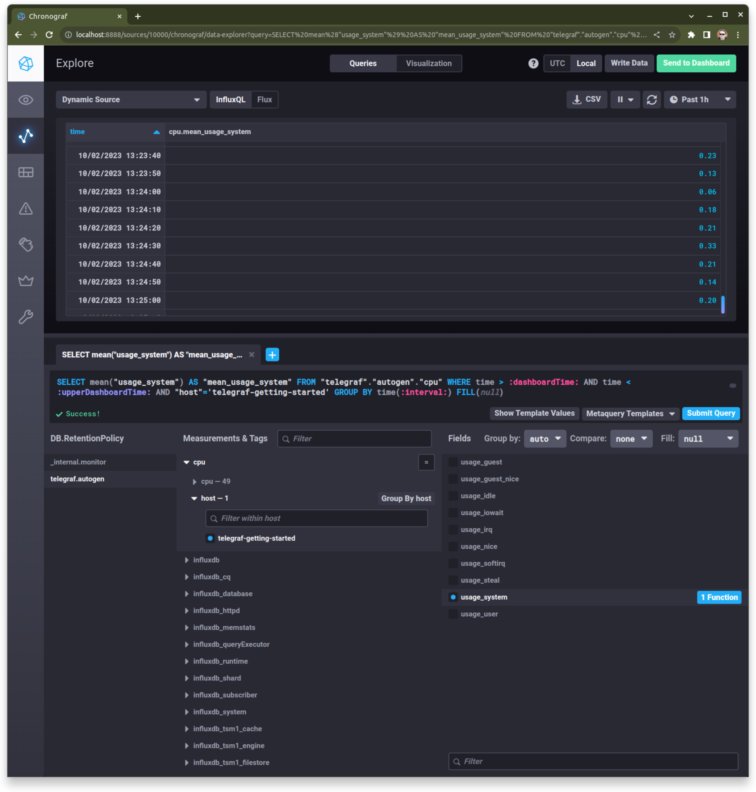
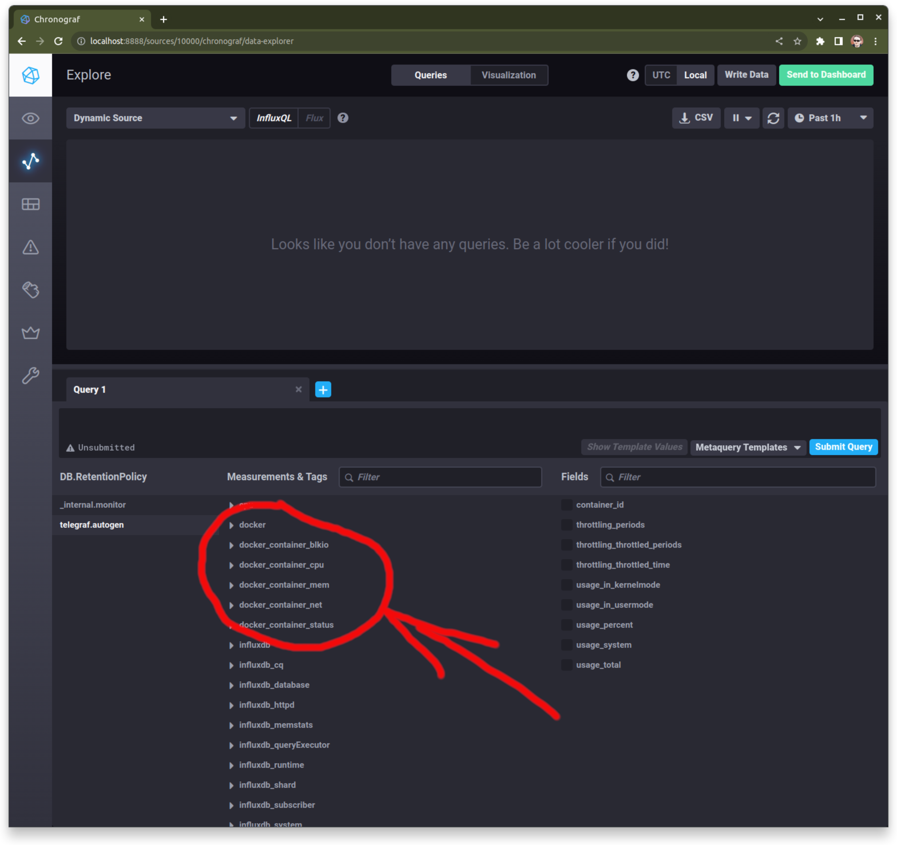

### Задание 1. Мониторинг на проект.  
Платформа для вычислений нагружающая CPU, сохраняющая текстовые отчеты на диск, взаимодействие по http.  
Следует наблюдать за:  
- Load Average, общей нагрузкой на систему где (для Linux) будет учтена нагрузка CPU и дисковая очередь;  
- CPU Utilization, нагрузкой на процессор, например, CPU user time для отслеживания нагрузки на отдельные ядра;  
- RAM usage, SWAP usage, нагрузкой на оперативную память и файл подкачки. Если приложению не хватает оперативной памяти и оно начинает писать в swap, производительность может радикально упасть;  
- Disk space usage, iops, inodes, объемом занятого пространства на диске и нагрузкой на диск чтоб приложение не столкнулось с нехваткой места и заранее отслеживать нестандартную нагрузку на диск;  
- http requests, например, отслеживать что система выдает HTTP код 200 на основной странице и включать оповещение об изменении кода на любой другой.  

### Задание 2. Метрики и качество обслуживания.  
RAM - общий объем и объем используемой оперативной памяти, отслеживаем для предотвращения использования swap.  
Inodes - блоки (кластеры в терминологии Windows) дискового устройства. При форматировании диска их создается конечное число (без учета некоторого количества зарезервированного для root) и может возникнуть ситуация, например, если в системе очень много маленьких файлов не занимающих блок полностью, когда inode уже подходят к концу, а свободного места еще много.  
CPUla - CPU load average, средняя нагрузка на процессор измеряемая для интервалов в 1, 5 и 15 минут. По ней можно определять состояние системы и динамику нагрузки CPU. Если значения равны 0.0, система простаивает, если значения выше числа процессорных ядер, могут быть проблемы с производительностью. Если значение для 1 минуты выше/ниже чем для 5 или 15, то нагрузка растет/снижается.  
Для определения качества обслуживания можно рассчитать SLI, индикатор качества обслуживания и сравнить его с SLO, целевым уровнем для понимания соответствия SLA, соглашения с клиентами.  

### Задание 3. Система сбора логов "на коленке".  
Подозреваю что если приложение представляет собой набор микросервисов, оно развернуто в каком-то оркестраторе на основе Docker и можно использовать некоторые ресурсы для развертывания системы сбора логов рядом. Например, это может быть Graylog+Elasticsearch+MongoDB. Получается что "все яйца в одной корзине" что плохо для разбора инцидентов, но для чтения логов работающих приложений приемлемо.  

### Задание 4. Ошибка в расчете SLA.  
Наверное, в расчете SLA неверно учтены коды ответов 3ХХ используемые для перенаправления. Они участвуют в общей статистике, но не являются ошибками. Их лучше суммировать с 2ХХ.  

### Задание 5. Плюсы и минусы push и pull систем мониторинга.  
Плюсы push (агент мониторинга отправляет данные на сервер):  
- допустима более гибкая настройка отправки пакетов данных;  
- проще дублирование данных, отправка в несколько систем одновременно;  
- допустимо использование UDP что повышает производительность передачи метрик.  
Плюсы pull (сервер периодически опрашивает агенты мониторинга):  
- проще отладка получения данных;  
- выше безопасность, легче контролировать подлинность данных и шифровать их.  

### Задание 6. Распределить системы мониторинга по модели сбора данных.  
- Prometheus. Pull.
- TICK. Push.
- Zabbix. Гибрид, доступен push и pull.
- VictoriaMetrics. Push.
- Nagios. Pull.

### Задание 7. Запуск TICK.  
Клонировал репозиторий, запустил, подождал некоторое время для сбора статистики:  
  

### Задание 8. Интерфейс Chronograf.  
Интерфейс в текущей версии немного отличается от рекомендаций в задании, но всё получилось:  
  

### Задание 9. Подключить метрики Docker в Telegraf.  
Пришлось найти и изучить конфиг telegraf, еще раз просмотреть docker-compose файл чтоб понять что нужный плагин уже включен и разделы смонтированы, но метрики докера не появлялись. В логах контейнер жаловался на отсутствие доступа. После чтения документации и гугления решил проблему добавив параметр "user: telegraf:998" в compose.  
  
