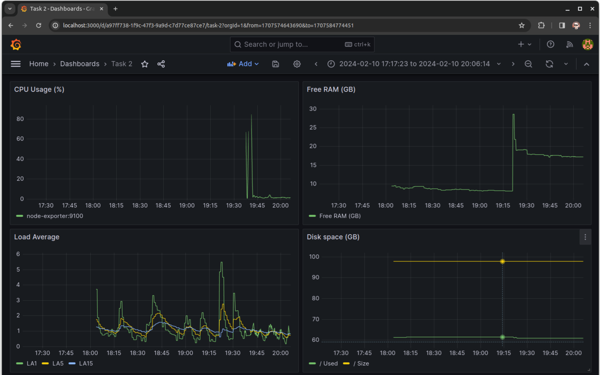
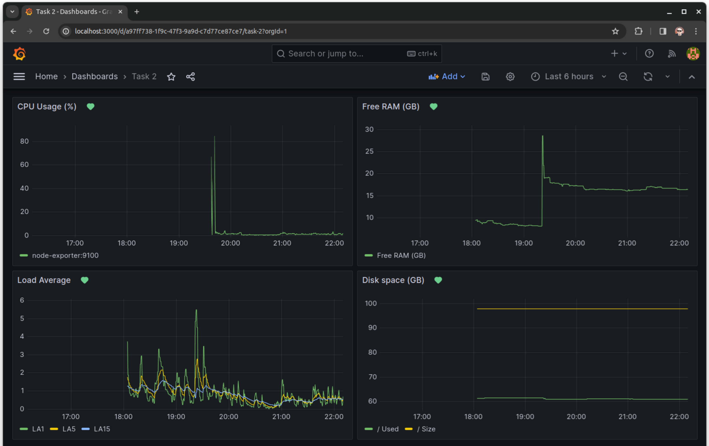
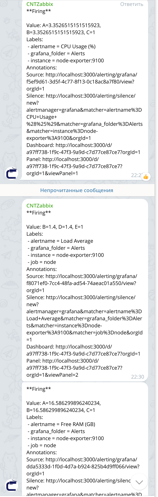
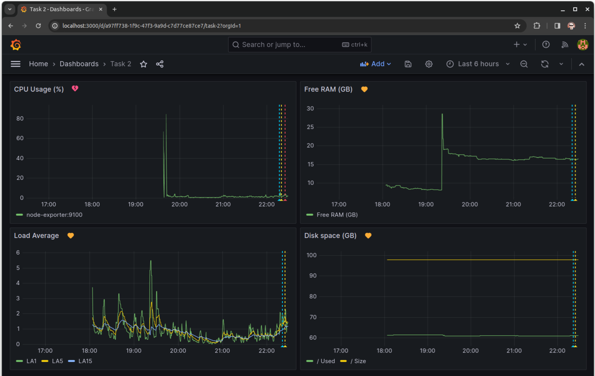

### Задание повышенной сложности.  
Для развертывания prometheus, node-exporter и Grafana написаны [docker-compose.yml](docker-compose.yml) и [конфиг prometheus](prometheus.yml).  

### Задание 1. Подключение Datasource и пруфы.  
Вошел в веб-интерфейс развернутой Grafana, сменил дефолтный пароль, подключил соседний prometheus.  

### Задание 2. Создание дашбордов с панелями.  
Использованные запросы PromQL:  

CPU Usage (%)  
    100 - (avg by (instance) (rate(node_cpu_seconds_total{job="node",mode="idle"}[1m])) * 100)  

LoadAverage 1/5/15  
    node_load1  
    node_load5  
    node_load15  

Free RAM  
    node_memory_MemFree_bytes/1073741824  

Disk space (GB)  
    Size  
        (node_filesystem_size_bytes{device="/dev/nvme0n1p6",mountpoint="/"}-node_filesystem_avail_bytes{device="/dev/nvme0n1p6",mountpoint="/"})/1073741824  
    Used  
        node_filesystem_size_bytes{device="/dev/nvme0n1p6",mountpoint="/"}/1073741824  

Получившийся дашборд:  
  

### Задание 3. Оповещения для дашборда.  
Настроены со следующими значениями:  
CPU Usage > 80%  
LA5 > 12 (24 cores)  
Free RAM < 15%  
Free disk space < 15%  
  

Для получения оповещений инвертировал условия (ABOVE-BELOW) или каким-то другим образом подстроил срабатываение.  
Получил уведомления в Telegram:  
  
Дашборд разнообразился желтыми, а потом и красными сердечками:  
  

### Задание 4. Экспорт в JSON.  
[Файл здесь](Dashboard.json)  

