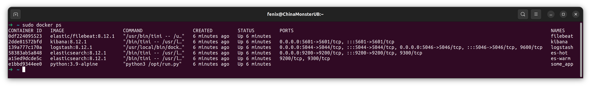
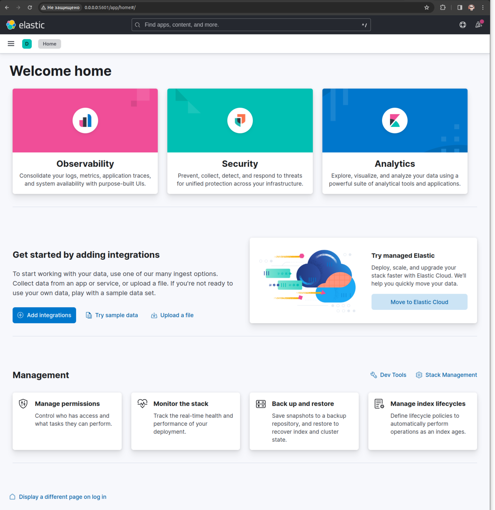
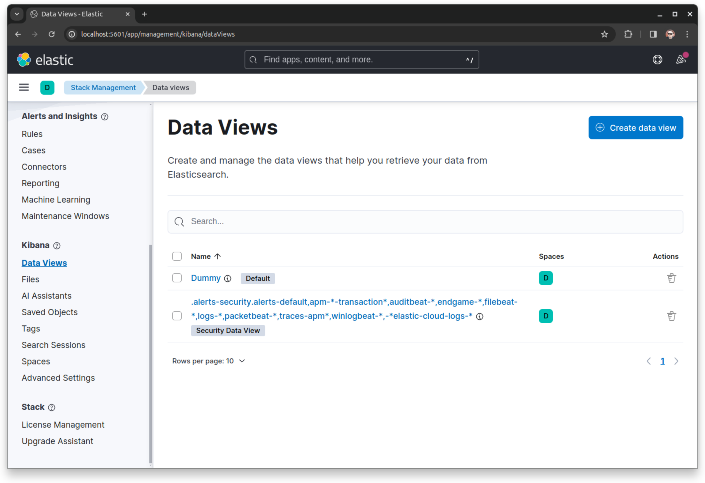
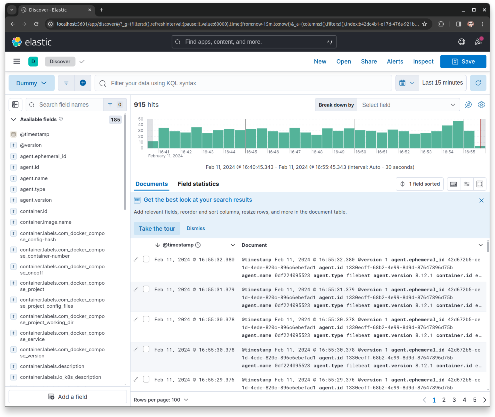
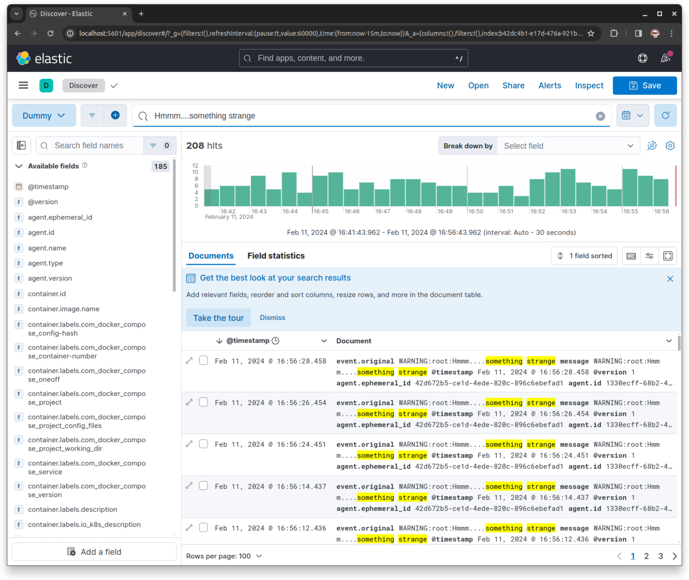

### Задание повышенной сложности.  
В этот раз не осилил, сломался на запуске кластера elasticsearch.  

### Задание 1. Запуск контейнеров.  
Все шесть работают больше 5 минут.  
  
Интерфейс Kibana:  
  

### Задание 2. Index-patterns, logs, dummy-app.  
Перешел в меню создания индекс-паттернов, создал паттерн Dummy по маске logstash-*  
  

В меню просмотра логов уже накопилось более 900~~0~~ записей из докера:  
  

Если использовать полнотекстовый поиск можно найти рандомные записи сгенерированные приложением:  

